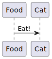

Buy food scheme. 


<details>

```
@startuml buy_food
participant      "Соц.сети иноагента"      as p_res
actor       Пользователь       as usr
participant      "Info bot"      as ib
participant      "mtproto" as mtp
participant      "Buy bot"      as bb
database    "Active sellers list"    as asdb
participant "Seller" as sl
database    "Food list"    as fdb
queue       "XMR"       as xmr
queue       "Фиат"       as ft

usr --> usr: Хочет перевести донат
usr -> p_res: Получает из соцсети идентификатор, который был создан в Get Food bot
usr <-- p_res: Анонимный идентификатор доната
usr -> ib: /start
usr <--ib: Информацию о боте с предложением начать новую сессию
usr -> ib: Нажатие кнопки "новый донат"
ib ->  mtp: Создание нового плажетного бота
ib <-- mtp: Информация о новом платежном боте
usr <-- ib: Информация о новом платежном боте
usr -> bb: Переход в платежного бота
usr -> bb: Идентификатор целевой платформы для доната
bb -> fdb: Проверка и сопоставление идентификатора
bb <- fdb: Получение информации о доступности кошелька
bb -> asdb: Проверка активных предложений, выбор самого выгодного на данный момент
bb <-- asdb: Выбор самого выгодного предложения
usr <-- bb: Отправка информации пользователю, подтверждение
usr -> bb: Согласие на отправку
bb -> sl: Проверка активности заявки
note right
Связь с продавцом происходит через бота sell food bot
end note
bb <- sl: Подтверждение заявки
bb <- sl: Отправка фиатного счета
usr <-- bb: Информация для перевода фиата
usr -> ft: Перевод фиата
usr -> bb: Подтверждение перевода
bb -> sl: Подтверждение перевода
bb -> xmr: Создание одноразового кошелька
bb -> sl: Отправка информации о кошельке XMR для перевода
sl -> xmr: Перевод денег
bb -> xmr: Проверка перевода
bb -> sl: Перевод с промежуточного счета на целевой счет получателя доната
usr <- bb: Уведомление о доставке средств
bb -> ib: При желании пользователя создание новой записи об уведомлении через месяц, удаление старой записи
bb -> bb: Самоочистка и удаление.
@enduml
```

</details>

Some more markdown.