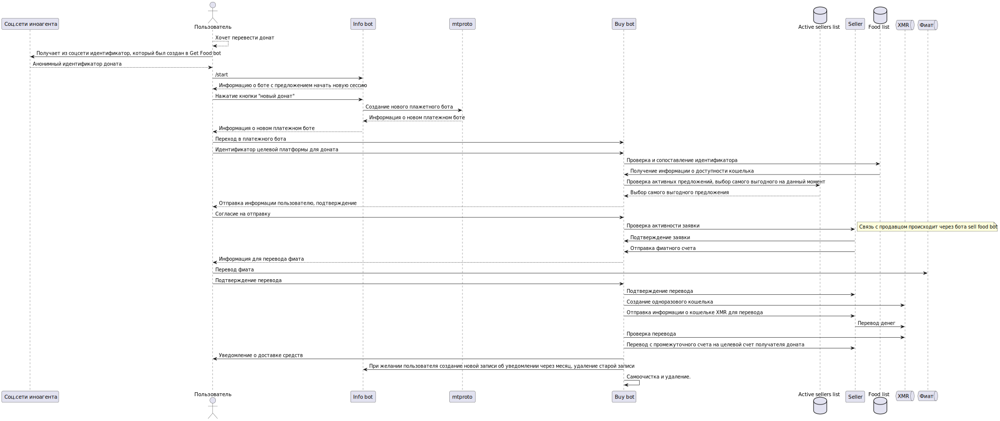

Buy food scheme. 


<details>

```
@startuml buy_food
actor       Пользователь       as usr
participant      "Info bot"      as ib
participant      "mtproto"
participant      "Buy bot"      as bb
database    "Active sellers list"    as asdb
database    "Food list"    as fdb
queue       "XMR"       as xmr

Food -> Cat: Eat!
@enduml
```

</details>

Some more markdown.