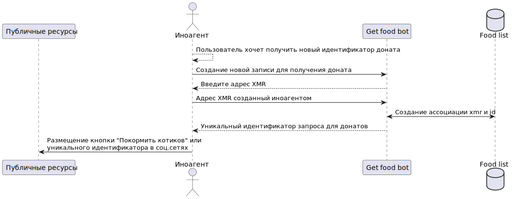

Схема получения корма для иноагента


<details>

```
@startuml get_food
participant      "Публичные ресурсы"      as p_res
actor       Иноагент       as usr
participant      "Get food bot"      as gfb
database    "Food list"    as fdb

usr --> usr: Пользователь хочет получить новый идентификатор доната
usr -> gfb: Создание новой записи для получения доната
usr <-- gfb: Введите адрес XMR
usr -> gfb: Адрес XMR созданный иноагентом
gfb <-> fdb: Создание ассоциации xmr и id
usr <-- gfb: Уникальный идентификатор запроса для донатов
p_res <- usr: Размещение кнопки "Покормить котиков" или\nуникального идентификатора в соц.сетях
@enduml
```

</details>