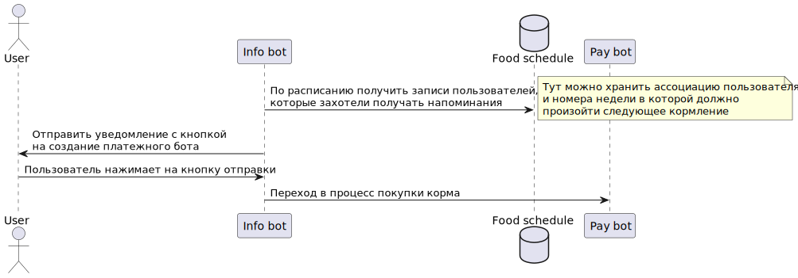

Схема уведомлений о времени следующего доната


<details>

```
@startuml notify_hungry_cat
actor       User       as usr
participant      "Info bot"      as ifb
database    "Food schedule"    as fdb
participant      "Pay bot"      as pbt

ifb -> fdb: По расписанию получить записи пользователей,\nкоторые захотели получать напоминания
note right
Тут можно хранить ассоциацию пользователя
и номера недели в которой должно
произойти следующее кормление
end note
ifb -> usr: Отправить уведомление с кнопкой\nна создание платежного бота
usr -> ifb: Пользователь нажимает на кнопку отправки
ifb -> pbt: Переход в процесс покупки корма
@enduml
```

</details>